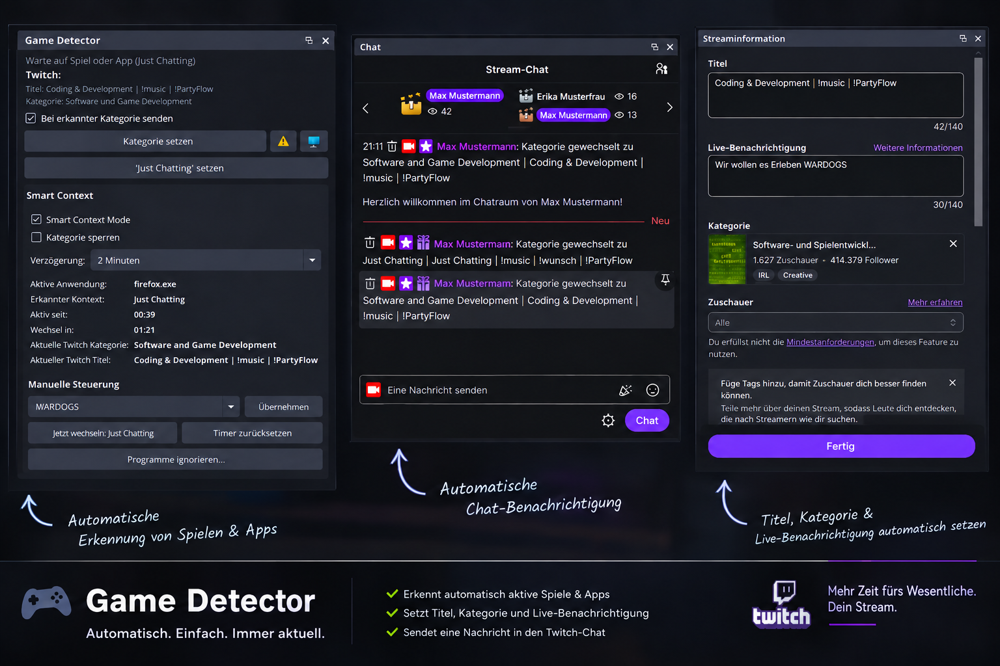

 [English](README.md) | [Português (BR)](README.pt-BR.md) 

# Game Detector OBS Plugin
  

Plugin to detect installed games and integrate with Twitch  
OBS Plugins Page: https://obsproject.com/forum/resources/game-detector.2260/

**🎯 Minimum OBS Version: 28.0+** | **Latest Built: OBS 31.1.1**

---

## 📘 About Game Detector OBS Plugin

GameDetector is a plugin for OBS Studio that automatically identifies games installed on your PC (Steam and Epic Games), allowing:

- Automatic game selection  
- Twitch integration
- Editing and correction of detected game names and executables  
- Automatic metadata creation  
- User-friendly interface inside OBS  

The focus is speed, accurate detection, and zero performance impact.

## 📥 Installation and Usage

Checkout the [WIKI Page](../../wiki)

## 🤝 Credits

Developed by **Fábio F. Magalhães (FabioZumbi12)**.  
Contributions and PRs are welcome!

---

## 🧠 Smart Context Mode (fork)

This branch is a modified version that adds **Smart Context Mode**: instead of only
detecting *that* a game is running, it evaluates the Windows **foreground window** to
detect which application you are actually using, and switches the Twitch category and
stream title only after that application has been in front for a configurable time
(default 5 minutes), with anti-flapping and a category lock.

**What it adds:**

- Foreground window detection — not "is a game running" but "what am I actually using"
- Category **and** stream title set together through the Twitch API
- Editable rule list: process (with `*` / `?` wildcards), optional window title match,
  category, title template, per-rule delay, ignore flag, priority
- Anti-flapping: 60 s cooldown after each switch, 60 s alt-tab tolerance, ignored
  applications stay completely neutral
- Dedicated editor for ignored applications, with one-click "add the app in front"
- Optional chat announcement after each switch
- Manual override: apply a category, switch now, reset the timer
- Category lock that blocks every automatic change
- German translation

📄 **Installation and setup: [INSTALL.md](INSTALL.md)** (German)
📄 **Full list of changes: [FORK-CHANGES.md](FORK-CHANGES.md)**

Windows only — the foreground detection uses Windows APIs. Requires OBS 28+
(tested on 32.2.1).

---

## 👤 Credits

**Original plugin** by **Fábio F. Magalhães (FabioZumbi12)**
<https://github.com/FabioZumbi12/game-detector>

**Smart Context Mode** by **Tobias Schlothane** — [it-kicodebyts.com](https://it-kicodebyts.com)
Designed, specified and tested by Tobias Schlothane, implemented together with
[Claude Code](https://claude.com/claude-code) (Anthropic).

Licensed under the **GNU General Public License v2.0**, like the original.
If you pass this plugin on, you have to pass the source along with it.
